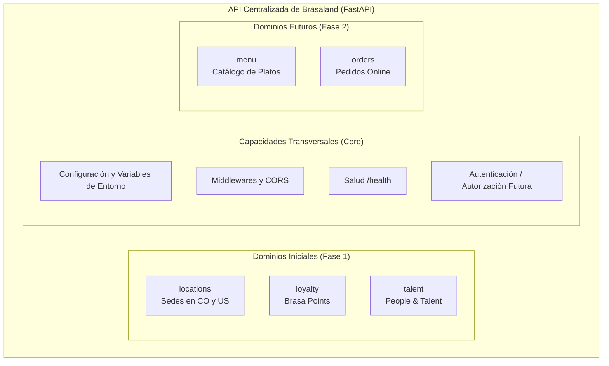

# Propuesta de Arquitectura Backend — Brasaland

Este documento establece la propuesta técnica y arquitectónica para el diseño del backend centralizado de **Brasaland** antes de comenzar su implementación con FastAPI. Todas las decisiones están fundamentadas en los requerimientos de negocio de [CONTEXT.md](CONTEXT.md), la estructura del monorepo y los sistemas desarrollados en los hitos previos.

---

## 1. Contexto y Objetivos

### 1.1. Contexto de Negocio

Brasaland es una cadena de restaurantes de comida a la parrilla fundada en 2008 en Medellín, Colombia. Actualmente opera 14 restaurantes propios distribuidos en dos países: 10 en Colombia (Medellín, Bogotá y Cali) y 4 en Estados Unidos (Miami y Orlando, Florida), con un equipo de aproximadamente 115 colaboradores.

A través del equipo interno **Brasaland Digital**, la compañía avanza en su transformación digital para superar las limitaciones de su presencia web histórica y dotar a la organización de herramientas operativas escalables.

### 1.2. Sistemas Actuales y Necesidades de Integración

El monorepo cuenta actualmente con las siguientes aplicaciones y paquetes:

1. **Website Público ([uis/website](uis/website)):**
   - Landing page corporativa que presenta la marca, historia y sedes en ambos países.
   - Formulario de registro para el programa de fidelización digital **Brasa Points**.
   - _Situación actual:_ El formulario realiza validaciones en el navegador y simula el envío del registro en cliente. Requiere una API centralizada para persistir los registros de clientes, validar reglas de negocio en servidor y servir la información oficial y actualizada de las 14 sedes.

2. **Backoffice Operacional ([uis/backoffice](uis/backoffice)):**
   - Interfaz web interna para la gestión operativa y consulta de indicadores de sedes y prioridades de transformación digital.
   - _Situación actual:_ Presenta datos estáticos en el cliente. Requiere consumir un backend unificado para consultar métricas, estado de sedes y registros del programa de lealtad.

3. **Talent Pipeline Tracker ([uis/talent-pipeline-tracker](uis/talent-pipeline-tracker)):**
   - Aplicación interna desarrollada en Next.js para el equipo de People & Talent, destinada a la gestión del pipeline de selección de candidatos y notas internas.
   - _Situación actual:_ Consume una API REST externa asignada para su hito. Una API propia centralizada de Brasaland podría asumir en el futuro la persistencia y gestión de los procesos de selección de la compañía si se decide unificar dicha infraestructura.

4. **Paquete de Dominio ([packages/brasaland-domain](packages/brasaland-domain)):**
   - Librería compartida en TypeScript con modelos, validaciones y datos de referencia de restaurantes. Aunque el backend en Python implementará sus propios esquemas y validaciones, este paquete sirve como referencia de consistencia semántica en todo el proyecto.

### 1.3. Problemas que Resuelve una API Centralizada

- **Punto único de verdad:** Elimina la duplicación y dispersión de datos maestros (sedes, reglas de acumulación de puntos, datos de contacto).
- **Persistencia y procesamiento real:** Permite recibir y almacenar registros reales de Brasa Points, sustituyendo las simulaciones locales en JavaScript.
- **Seguridad y validación autoritativa:** Garantiza que las reglas críticas (como la mayoría de edad para Brasa Points o formatos telefónicos internacionales) se apliquen de forma estricta en el servidor, sin depender exclusivamente de las validaciones en el cliente.
- **Base para futuras capacidades:** Prepara a Brasaland para incorporar funcionalidades planificadas como pedidos online (_orders_) y menús dinámicos sin rehacer la arquitectura.

---

## 2. Patrón Arquitectónico Propuesto

### 2.1. Evaluación de Opciones

| Patrón                        | Descripción                                                                                                                   | Evaluación para Brasaland                                                                                                                                                                                                                   |
| :---------------------------- | :---------------------------------------------------------------------------------------------------------------------------- | :------------------------------------------------------------------------------------------------------------------------------------------------------------------------------------------------------------------------------------------ |
| **MVC Tradicional**           | Modelo-Vista-Controlador acoplado                                                                                             | No aplica directamente a un backend desacoplado que solo expone una API REST JSON para interfaces SPA o estáticas independientes.                                                                                                           |
| **Microservicios**            | Servicios independientes por dominio, con bases de datos y despliegues separados                                              | **Desaconsejado.** Para una empresa con 14 ubicaciones y un equipo de desarrollo ágil, introducir microservicios de forma prematura generaría sobrecostes de red, complejidad de coordinación, latencia innecesaria y sobrecarga operativa. |
| **Serverless (Funciones)**    | Ejecución de funciones efímeras por evento                                                                                    | Puede dificultar la consistencia de modelos compartidos, pruebas de integración y la mantenibilidad de la lógica de dominio en el monorepo.                                                                                                 |
| **Monolito Modular en Capas** | Una sola aplicación backend organizada internamente por módulos de dominio cohesivos y separación en capas de responsabilidad | **Seleccionado.** Mantiene la simplicidad de desarrollo y despliegue de una sola base de código mientras garantiza límites claros entre dominios.                                                                                           |

### 2.2. Justificación de la Elección

Se propone una arquitectura de **Monolito Modular en Capas (Layered Modular Monolith)** implementada en **FastAPI**.

Esta decisión se alinea estrictamente con las directrices del repositorio en [services/README.md](services/README.md) y el [README.md](README.md) raíz:

1. **Escala adecuada:** Brasaland necesita una solución robusta y mantenible, sin la fricción de arquitecturas distribuidas complejas.
2. **Encaje en el monorepo:** Permite alojar el backend bajo una carpeta de servicio clara (por ejemplo `services/api/`), interactuando limpiamente con las interfaces de [uis/](uis/).
3. **Mantenibilidad y evolución:** Al aislar cada dominio de negocio (sedes, lealtad, talento) en su propio módulo con capas diferenciadas (router, servicio, esquema, repositorio), el sistema puede crecer ordenadamente. Si en el futuro un dominio experimentara una demanda masiva, su separación modular facilitaría su extracción a un servicio independiente sin necesidad de reescribir la lógica de negocio.

---

## 3. Estructura Propuesta del Backend

Para estructurar la aplicación backend dentro de la carpeta [services/](services/), se propone como convención organizarla bajo un directorio como `services/api/`.

### 3.1. Árbol de Directorios Propuesto (Conceptual)

```text
services/
└── api/                              # Nombre propuesto para el servicio de API centralizada
    ├── README.md                     # Documentación técnica y guía de ejecución
    ├── requirements.txt              # Dependencias del backend (FastAPI, Uvicorn, etc.)
    └── app/
        ├── __init__.py
        ├── main.py                   # Instanciación de FastAPI, configuración de CORS y registro de routers
        ├── core/                     # Capacidades transversales y de infraestructura
        │   ├── __init__.py
        │   ├── config.py             # Carga y gestión centralizada de variables de entorno
        │   └── security.py           # Utilidades de seguridad / headers (futuro)
        ├── db/                       # Configuración de base de datos y sesiones
        │   ├── __init__.py
        │   └── session.py
        └── domains/                  # Módulos organizados por dominio de negocio
            ├── locations/            # Dominio de Sedes / Restaurantes
            │   ├── __init__.py
            │   ├── router.py         # Endpoints FastAPI (APIRouter)
            │   ├── schemas.py        # Modelos Pydantic (Request / Response)
            │   ├── service.py        # Lógica y reglas de negocio del dominio
            │   ├── models.py         # Modelos de persistencia / ORM
            │   └── repository.py     # Acceso a datos y consultas
            ├── loyalty/              # Dominio de Brasa Points / Fidelización
            │   ├── __init__.py
            │   ├── router.py
            │   ├── schemas.py
            │   ├── service.py
            │   ├── models.py
            │   └── repository.py
            └── talent/               # Dominio de People & Talent (candidatos y selección)
                ├── __init__.py
                ├── router.py
                ├── schemas.py
                ├── service.py
                ├── models.py
                └── repository.py
```

### 3.2. Propósito y Responsabilidad de Cada Nivel

- **`app/main.py`:** Punto de entrada de la aplicación. Configura el ciclo de vida de FastAPI, incluye los middlewares transversales (como CORS) y monta los routers versionados de cada dominio.
- **`app/core/`:** Aloja configuraciones transversales que no pertenecen a un dominio de negocio específico, como la lectura de variables de entorno y utilidades globales.
- **`app/db/`:** Centraliza la conexión con el motor de persistencia y la provisión de sesiones para la inyección de dependencias.
- **`app/domains/<dominio>/`:**
  - **`router.py`:** Capa de transporte HTTP. Define las rutas, métodos HTTP, códigos de estado, parámetros de entrada y esquemas de respuesta. No contiene lógica de negocio pesada ni consultas a base de datos.
  - **`schemas.py`:** Define los contratos de datos (Data Transfer Objects) mediante esquemas de validación de FastAPI (Pydantic), asegurando la validación y serialización de peticiones y respuestas.
  - **`service.py`:** Capa de negocio. Implementa las reglas operativas y cálculos de Brasaland (ej. validación de acumulación de puntos, políticas de edad, flujos de estado).
  - **`models.py`:** Define la estructura de las tablas o entidades en la base de datos.
  - **`repository.py`:** Capa de acceso a datos. Encapsula las consultas y operaciones de persistencia, aislando la lógica de negocio del motor de base de datos concreto.

---

## 4. Separación por Dominios de Negocio

La delimitación de dominios surge directamente de la realidad operativa de Brasaland documentada en [CONTEXT.md](CONTEXT.md) y de los desarrollos existentes en el monorepo.



### 4.1. Dominios Iniciales (Fase 1)

1. **`locations` (Sedes y Restaurantes):**
   - **Justificación:** Brasaland cuenta con 14 sedes en 2 países (10 en Colombia: Medellín, Bogotá, Cali; 4 en EE.UU.: Miami, Orlando).
   - **Responsabilidad:** Listar sedes, filtrar por país y ciudad, consultar horarios (11:00 AM - 10:00 PM), teléfonos y direcciones.
   - **Consumidores:** [uis/website](uis/website) (selector dinámico del formulario y vista de sedes) y [uis/backoffice](uis/backoffice) (tablero de ubicaciones).

2. **`loyalty` (Programa Brasa Points):**
   - **Justificación:** Es el foco estratégico de marketing para sustituir las tarjetas físicas por un programa digital.
   - **Responsabilidad:** Registro de usuarios en Brasa Points, validación estricta de edad (mínimo 18 años), preferencias alimentarias, origen del contacto, aceptación de términos y reglas de acumulación (1 punto por cada $10.000 COP o $5 USD).
   - **Consumidores:** [uis/website](uis/website) (formulario de inscripción) y [uis/backoffice](uis/backoffice) (seguimiento del programa).

3. **`talent` (People & Talent / Reclutamiento):**
   - **Justificación:** La empresa gestiona procesos de selección para cerca de 115 empleados operativos y corporativos.
   - **Responsabilidad:** Modelar candidatos, etapas del proceso (`pending`, `review`, `personal_interview`, `technical_interview`, `offer_presented`), estados (`received`, `in_progress`, `selected`, `discarded`) y notas internas.
   - **Consumidores:** Preparado para una futura integración o persistencia interna de herramientas de talento como [uis/talent-pipeline-tracker](uis/talent-pipeline-tracker).

### 4.2. Dominios y Capacidades Futuras (Fase 2)

- **`menu` (Menú y Platos):**
  - Gestión centralizada del catálogo de comidas a la parrilla, categorías y precios por moneda (COP / USD).
- **`orders` (Pedidos Online):**
  - Respaldado explícitamente por el mensaje de [CONTEXT.md](CONTEXT.md): _"Want to place an order? Call your favorite location or visit us directly. Online ordering coming soon!"_.
- **Autenticación y Autorización (`auth`):**
  - Capacidad transversal futura necesaria para proteger los endpoints internos utilizados por el backoffice y los sistemas de People & Talent, separándolos del acceso público de clientes.

### 4.3. Relación con `brasaland-domain`

El paquete TypeScript [packages/brasaland-domain](packages/brasaland-domain) contiene interfaces y datos de referencia ya validados en el frontend. El backend en Python no reutiliza directamente dicho código fuente, pero debe respetar los mismos conceptos de negocio, nombres de ciudades, sedes y tipos para preservar la coherencia semántica en todo el monorepo. El backend mantendrá sus propios esquemas y validaciones autoritativas.

---

## 5. Organización de Routers y Endpoints FastAPI

La API adoptará una convención REST organizada mediante `APIRouter` de FastAPI, estructurada bajo un prefijo global versionado `/api/v1`.

### 5.1. Esquema Conceptual de Rutas

```text
/api/v1/
├── /locations
│   ├── GET    /locations                  # Listar todas las sedes (soporta filtros ?country=Colombia&city=Medellin)
│   └── GET    /locations/{location_id}    # Detalle de una sede específica
│
├── /loyalty
│   ├── POST   /loyalty/registrations      # Registrar nuevo miembro en Brasa Points (+18, datos requeridos)
│   └── GET    /loyalty/summary            # Resumen de métricas del programa para backoffice
│
└── /talent
    ├── GET    /talent/candidates          # Listar candidatos (?status=...&stage=...&search=...)
    ├── POST   /talent/candidates          # Crear nueva candidatura
    ├── GET    /talent/candidates/{id}     # Detalle de un candidato
    ├── PATCH  /talent/candidates/{id}     # Actualizar etapa o estado del candidato
    ├── GET    /talent/candidates/{id}/notes # Listar notas de un candidato
    └── POST   /talent/candidates/{id}/notes # Añadir nota interna a un candidato
```

### 5.2. Justificación de la Agrupación

- **Agrupación por recurso/dominio:** Cada `APIRouter` se define dentro de su propio módulo (`domains/<dominio>/router.py`) con sus etiquetas (_tags_) para la documentación automática OpenAPI/Swagger.
- **Versionado explícito (`/api/v1`):** Permite evolucionar los contratos de la API en el futuro sin romper el funcionamiento de las interfaces que consumen versiones previas.
- **Modularidad en `main.py`:** Los routers se registran en la aplicación principal con una sola línea por módulo mediante `app.include_router(...)`, manteniendo el archivo principal conciso y desacoplado.

---

## 6. Investigación sobre Estructura FastAPI

Para asegurar que la propuesta sigue los estándares de la industria, se analizaron las directrices de la documentación oficial de FastAPI respecto a aplicaciones de mayor escala y múltiples archivos (_Bigger Applications - Multiple Files_).

### 6.1. Convenciones Oficiales Identificadas

1. **Uso de `APIRouter` independientes:**
   FastAPI recomienda estructurar aplicaciones complejas dividiendo los endpoints en instancias de `APIRouter` dedicadas por módulo o funcionalidad, en lugar de declarar todas las rutas sobre el objeto principal `app`.
2. **Inclusión centralizada de routers con prefijos y tags:**
   La aplicación principal (`FastAPI()`) incluye cada sub-router especificando su `prefix` (ej. `/api/v1/locations`) y `tags` (ej. `["Locations"]`), facilitando la generación limpia de la documentación interactiva en `/docs`.
3. **Inyección de Dependencias (`Depends`):**
   FastAPI promueve el uso del sistema de dependencias para gestionar conexiones a bases de datos, autenticación y servicios de negocio, asegurando que los routers no instancien clientes manualmente ni gestionen ciclos de vida de recursos de bajo nivel.
4. **Validación Declarativa con Esquemas (Pydantic):**
   La separación entre esquemas de entrada (validación de payload entrante) y salida (filtrado y serialización de respuesta) es el pilar de robustez de FastAPI, previniendo la exposición accidental de campos internos.

---

## 7. Frontend y Backend como Sistemas Separados

Las aplicaciones de interfaz ([uis/website](uis/website), [uis/backoffice](uis/backoffice)) y el backend ([services/](services/)) son sistemas independientes que se comunican exclusivamente a través del protocolo **HTTP en formato JSON**.

```mermaid
flowchart LR
    subgraph Frontend ["Capa de Interfaces (uis/)"]
        Web["uis/website<br/>(Landing + Formulario)"]
        Back["uis/backoffice<br/>(Panel Operativo)"]
    end

    subgraph Backend ["Capa Backend (services/api)"]
        API["FastAPI App<br/>(/api/v1)"]
        DB[(Base de Datos)]
    end

    Web -->|HTTP / JSON (CORS)| API
    Back -->|HTTP / JSON (CORS)| API
    API -->|Consultas internas| DB

    style DB fill:#f9f,stroke:#333,stroke-width:1px
```

### 7.1. Aislamiento de la Base de Datos

Ninguna interfaz de usuario accede directamente a la base de datos ni a motores de almacenamiento interno. Todo acceso a datos está mediado por la API, la cual aplica autenticación, validación de esquemas y reglas de negocio.

### 7.2. Configuración de URLs Base y Variables de Entorno

- Las aplicaciones cliente configuran la URL base del backend mediante variables de entorno en tiempo de ejecución o desarrollo:
  - En aplicaciones estáticas ([uis/website](uis/website), [uis/backoffice](uis/backoffice)): mediante variables globales de configuración en un archivo `config.js` o variables de entorno locales.
  - En aplicaciones React/Next.js ([uis/talent-pipeline-tracker](uis/talent-pipeline-tracker)): mediante `NEXT_PUBLIC_API_URL` configurado en `.env.local` y documentado en `.env.example`.
- El backend nunca fija URLs absolutas en el código fuente; los puertos y hosts se parametrizan en su propia configuración.

### 7.3. Política de CORS (Cross-Origin Resource Sharing)

Dado que las interfaces frontend y el backend se ejecutan en diferentes puertos u orígenes durante el desarrollo local (y en diferentes dominios o subdominios en producción), FastAPI debe configurar el middleware oficial `CORSMiddleware`.

- **Desarrollo local:** Se configuran orígenes permitidos explícitos para las aplicaciones locales (ej. `http://localhost:3000`, `http://localhost:5500`, `http://127.0.0.1:5500`).
- **Producción:** Se restringen los orígenes exclusivamente a los dominios oficiales de la empresa (`https://brasaland.com`, `https://backoffice.brasaland.com`).
- **Seguridad:** No se debe utilizar `allow_origins=["*"]` en producción, especialmente si se manejan credenciales o datos internos.

---

## 8. Decisiones Técnicas Iniciales

A continuación se resumen las decisiones técnicas clave para la futura implementación del backend:

1. **API Única Centralizada:**
   - Se mantiene un único backend en FastAPI bajo `services/` para toda la compañía, evitando la fragmentación en microservicios durante esta etapa del proyecto.
2. **Versionado de Rutas (`/api/v1`):**
   - Todos los endpoints de negocio se agruparán bajo el prefijo `/api/v1/` para permitir una evolución controlada sin romper clientes existentes.
3. **Configuración Centralizada mediante Variables de Entorno:**
   - La configuración (puerto, entorno, cadenas de conexión, orígenes CORS) se gestionará en un módulo centralizado (`core/config.py`) que lee variables de entorno del sistema.
4. **Separación de Responsabilidades por Capas:**
   - **Transporte (Routers):** Reciben peticiones HTTP y delegan.
   - **Validación (Schemas):** Contratos de datos y validación de tipos.
   - **Negocio (Services):** Reglas operativas y cálculos de Brasaland.
   - **Persistencia (Repositories & Models):** Interacción aislada con la base de datos.
5. **Estrategia de Acceso a Datos:**
   - Se utilizará un patrón repositorio o capa de abstracción para que las reglas de negocio no dependan de la sintaxis específica del motor de base de datos.

---

## 9. Riesgos y Puntos de Atención

Se identifican los siguientes riesgos técnicos y arquitectónicos que deben vigilarse durante la fase de desarrollo:

1. **Riesgo 1: Lógica de negocio acumulada en los Routers (_Fat Routers_)**
   - _Consecuencia:_ Si las validaciones complejas, cálculos de puntos o consultas a base de datos se escriben directamente en las funciones del endpoint, el código se vuelve difícil de probar de forma unitaria, se duplica entre rutas y se acopla excesivamente al protocolo HTTP.
   - _Mitigación:_ Forzar que los routers únicamente validen la entrada mediante esquemas y deleguen la ejecución a la capa de `services`.

2. **Riesgo 2: Acoplamiento cruzado indebido entre dominios**
   - _Consecuencia:_ Si el módulo `loyalty` importa y manipula directamente modelos internos de `talent` o viceversa, se pierde la modularidad del monolito, generando un "gran fango" (_Big Ball of Mud_) que complicará cualquier refactorización futura.
   - _Mitigación:_ Definir interfaces y servicios claros; si un dominio requiere datos de otro, debe interactuar a través de su servicio público o funciones bien delimitadas.

3. **Riesgo 3: Duplicación y desalineación de reglas de negocio entre Frontend y Backend**
   - _Consecuencia:_ Si el frontend ([uis/website](uis/website)) y el backend implementan reglas distintas para la validación de edad, cálculo de puntos o formato de teléfono, se generarán errores confusos para los usuarios (ej. el formulario web acepta una entrada que el backend rechaza con error 422).
   - _Mitigación:_ Considerar las reglas documentadas en [packages/brasaland-domain](packages/brasaland-domain) como referencia de consistencia y mantener las especificaciones de validación alineadas en los esquemas del backend.

4. **Riesgo 4: Políticas CORS excesivamente permisivas en Producción**
   - _Consecuencia:_ Configurar `allow_origins=["*"]` en producción expone la API a ataques de origen cruzado no autorizados desde sitios web de terceros.
   - _Mitigación:_ Parametrizar la lista de orígenes permitidos a través de variables de entorno, usando listas estrictas para cada entorno.

5. **Riesgo 5: Fuga de datos sensibles entre dominios públicos y privados**
   - _Consecuencia:_ Exponer en endpoints públicos información sensible de candidatos o notas internas de People & Talent, o compartir modelos de respuesta sin filtrar campos privados.
   - _Mitigación:_ Uso estricto de esquemas de respuesta Pydantic diferenciados para entidades públicas y privadas, garantizando que nunca se retornen modelos de base de datos completos directamente al cliente.

---

## 10. Conclusión

La arquitectura de **Monolito Modular en Capas con FastAPI** propuesta para Brasaland proporciona el equilibrio adecuado entre simplicidad operativa y solidez estructural. Permite resolver de inmediato las necesidades de las aplicaciones existentes ([uis/website](uis/website), [uis/backoffice](uis/backoffice)) mediante una API centralizada, limpia y tipada, sin incurrir en la sobrecarga prematura de una infraestructura de microservicios. Al organizar el código en dominios de negocio claramente delimitados (`locations`, `loyalty`, `talent`) y separar la capa de transporte de la lógica de negocio, Brasaland dispone de una base técnica lista para escalar de manera orgánica a medida que se incorporen nuevas capacidades como pedidos online o menús dinámicos.

---

## 11. Referencias

Documentación oficial consultada para la elaboración de esta propuesta:

- **FastAPI — Bigger Applications - Multiple Files:**  
  [https://fastapi.tiangolo.com/tutorial/bigger-applications/](https://fastapi.tiangolo.com/tutorial/bigger-applications/)  
  _Guía oficial sobre la estructura modular basada en `APIRouter` y organización de paquetes por funcionalidad._

- **FastAPI — CORS (Cross-Origin Resource Sharing):**  
  [https://fastapi.tiangolo.com/tutorial/cors/](https://fastapi.tiangolo.com/tutorial/cors/)  
  _Documentación sobre la integración y configuración segura de `CORSMiddleware` en FastAPI._

- **FastAPI — Dependencies (Inyección de Dependencias):**  
  [https://fastapi.tiangolo.com/tutorial/dependencies/](https://fastapi.tiangolo.com/tutorial/dependencies/)  
  _Buenas prácticas para desacoplar lógica de infraestructura, bases de datos y seguridad en endpoints._

- **Pydantic Documentation:**  
  [https://docs.pydantic.dev/latest/](https://docs.pydantic.dev/latest/)  
  _Referencia de esquemas, serialización y validación de datos para APIs en Python._
