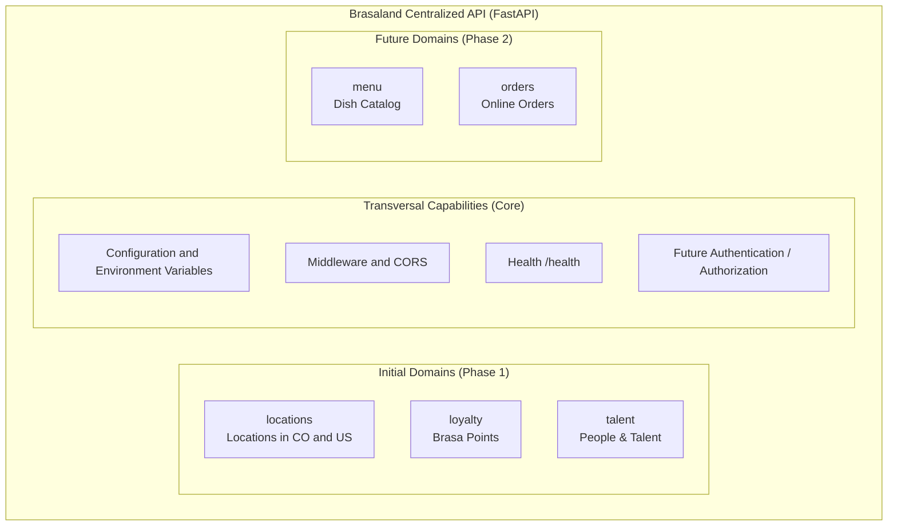

# Backend Architecture Proposal — Brasaland

This document establishes the technical and architectural proposal for the design of the centralized backend for **Brasaland** before beginning its implementation with FastAPI. All decisions are based on the business requirements in [CONTEXT.md](CONTEXT.md), the structure of the monorepo, and the systems developed in previous milestones.

---

## 1. Context and Goals

### 1.1. Business Context

Brasaland is a grilled food restaurant chain founded in 2008 in Medellín, Colombia. It currently operates 14 company-owned restaurants across two countries: 10 in Colombia (Medellín, Bogotá, and Cali) and 4 in the United States (Miami and Orlando, Florida), with a team of approximately 115 employees.

Through the internal team **Brasaland Digital**, the company is advancing its digital transformation to overcome the limitations of its legacy web presence and provide the organization with scalable operational tools.

### 1.2. Current Systems and Integration Needs

The monorepo currently contains the following applications and packages:

1. **Public Website ([uis/website](uis/website)):**
   - Corporate landing page presenting the brand, history, and locations across both countries.
   - Registration form for the **Brasa Points** digital loyalty program.
   - _Current situation:_ The form performs client-side validation in the browser and simulates registration submission on the client. It requires a centralized API to persist customer registrations, validate business rules on the server, and serve official, up-to-date information for the 14 locations.

2. **Operational Backoffice ([uis/backoffice](uis/backoffice)):**
   - Internal web interface for operational management and reviewing indicators for locations and digital transformation priorities.
   - _Current situation:_ Displays static data on the client. It requires consuming a unified backend to query metrics, location statuses, and loyalty program registrations.

3. **Talent Pipeline Tracker ([uis/talent-pipeline-tracker](uis/talent-pipeline-tracker)):**
   - Internal application built in Next.js for the People & Talent team to manage candidate hiring pipelines and internal notes.
   - _Current situation:_ Consumes an external REST API assigned for its milestone. A Brasaland-owned centralized API could assume persistence and management for company recruitment processes in the future if the decision is made to unify that infrastructure.

4. **Domain Package ([packages/brasaland-domain](packages/brasaland-domain)):**
   - Shared TypeScript library containing domain models, validations, and reference restaurant data. Although the Python backend will implement its own schemas and validations, this package serves as a reference for semantic consistency across the project.

### 1.3. Problems Solved by a Centralized API

- **Single source of truth:** Eliminates duplication and fragmentation of master data (locations, points accrual rules, contact details).
- **Real persistence and processing:** Enables receiving and storing real Brasa Points registrations, replacing local JavaScript simulations.
- **Security and authoritative validation:** Ensures critical rules (such as age verification for Brasa Points or international phone formats) are enforced strictly on the server, without relying solely on client-side validations.
- **Foundation for future capabilities:** Prepares Brasaland to incorporate planned features such as online ordering (_orders_) and dynamic menus without redesigning the architecture.

---

## 2. Proposed Architectural Pattern

### 2.1. Evaluation of Options

| Pattern                      | Description                                                                                                            | Evaluation for Brasaland                                                                                                                                                                                                          |
| :--------------------------- | :--------------------------------------------------------------------------------------------------------------------- | :-------------------------------------------------------------------------------------------------------------------------------------------------------------------------------------------------------------------------------- |
| **Traditional MVC**          | Coupled Model-View-Controller                                                                                          | Does not directly fit a decoupled backend that only exposes a JSON REST API for independent SPA or static frontend interfaces.                                                                                                    |
| **Microservices**            | Independent services per domain, with separate databases and deployments                                               | **Not recommended.** For a company with 14 locations and an agile development team, introducing microservices prematurely would introduce network overhead, coordination complexity, unnecessary latency, and operational burden. |
| **Serverless (Functions)**   | Ephemeral execution of functions per event                                                                             | Can hinder shared model consistency, integration testing, and maintainability of domain logic within the monorepo.                                                                                                                |
| **Layered Modular Monolith** | A single backend application organized internally into cohesive domain modules with separated layers of responsibility | **Selected.** Preserves development and deployment simplicity of a single codebase while guaranteeing clear boundaries between domains.                                                                                           |

### 2.2. Justification of the Choice

A **Layered Modular Monolith** architecture implemented in **FastAPI** is proposed.

This decision aligns strictly with repository guidelines in [services/README.md](services/README.md) and the root [README.md](README.md):

1. **Appropriate scale:** Brasaland needs a robust and maintainable solution without the friction of complex distributed architectures.
2. **Monorepo fit:** Allows hosting the backend under a clean service directory (for example `services/api/`), interacting cleanly with interfaces under [uis/](uis/).
3. **Maintainability and evolution:** By isolating each business domain (locations, loyalty, talent) in its own module with distinct layers (router, service, schema, repository), the system can grow cleanly. If a domain experiences massive demand in the future, its modular separation simplifies extracting it into an independent service without rewriting business logic.

---

## 3. Proposed Backend Structure

The backend is centralized under `services/api/` and organized using a lightweight layered structure.

The goal is to keep HTTP transport, business logic, data access, and validation models clearly separated without introducing unnecessary architectural complexity.

### 3.1. Proposed Directory Tree

```text
services/
└── api/
    ├── README.md                     # Technical documentation and run instructions
    ├── main.py                       # FastAPI application entry point
    ├── pyproject.toml                # Python project and dependency definition
    ├── uv.lock                       # Locked Python dependency versions
    │
    ├── models/                       # Pydantic request/response models
    │   ├── __init__.py
    │   ├── incidents.py
    │   └── suppliers.py              # Future milestone
    │
    ├── routes/                       # HTTP transport layer
    │   ├── __init__.py
    │   ├── incidents.py
    │   └── suppliers.py              # Future milestone
    │
    ├── services/                     # Application and business logic
    │   ├── __init__.py
    │   ├── incidents.py
    │   └── suppliers.py              # Future milestone
    │
    └── repositories/                 # State and persistence access
        ├── __init__.py
        ├── incidents.py
        └── suppliers.py              # Future milestone
```

### 3.2. Purpose and Responsibility of Each Level

- **`main.py`:** FastAPI application entry point. Configures middleware, CORS, application-level settings, and router registration.
- **`models/`:** Defines request and response contracts using Pydantic. Models contain validation and serialization concerns, not business logic.
- **`routes/`:** HTTP transport layer. Defines endpoints, HTTP methods, status codes, request handling, and response models. Routes should remain thin and delegate application logic to services.
- **`services/`:** Application and business logic layer. Coordinates use cases, applies domain rules, and delegates persistence or state access to repositories when required.
- **`repositories/`:** Encapsulates state and persistence access. This layer isolates services from storage details such as in-memory state, TinyDB, or future persistence mechanisms.

Not every feature is required to use every layer. Layers should only be introduced when they provide a concrete responsibility.

For example:

- Incident analysis reuses shared logic from `packages/incident_analysis`.
- Supplier management is expected to use the repository layer for TinyDB persistence.

### 3.3. Dependency Management

Python dependencies for the backend are managed with `uv`.

Project dependencies are declared in:

`services/api/pyproject.toml`

Resolved dependency versions are committed in:

`services/api/uv.lock`

The backend environment is synchronized with:

```bash
cd services/api
uv sync
```

The development server is started with:

```bash
uv run uvicorn main:app --reload
```

---

## 4. Separation by Business Domains

Domain boundaries derive directly from the operational reality of Brasaland documented in [CONTEXT.md](CONTEXT.md) and existing monorepo developments.



### 4.1. Initial Domains (Phase 1)

1. **`locations` (Locations and Restaurants):**
   - **Justification:** Brasaland has 14 locations across 2 countries (10 in Colombia: Medellín, Bogotá, Cali; 4 in the US: Miami, Orlando).
   - **Responsibility:** List locations, filter by country and city, query operating hours (Mon-Sun 11:00 AM - 10:00 PM), phone numbers, and addresses.
   - **Consumers:** [uis/website](uis/website) (dynamic form selector and location view) and [uis/backoffice](uis/backoffice) (locations dashboard).

2. **`loyalty` (Brasa Points Loyalty Program):**
   - **Justification:** Core strategic marketing initiative to replace physical stamp cards with a digital program.
   - **Responsibility:** User registration in Brasa Points, strict age validation (minimum 18 years old), dietary preferences, referral source, terms acceptance, and points accrual rules (1 point per 10,000 COP or 5 USD).
   - **Consumers:** [uis/website](uis/website) (registration form) and [uis/backoffice](uis/backoffice) (loyalty program monitoring).

3. **`talent` (People & Talent / Recruitment):**
   - **Justification:** Brasaland has approximately 115 employees and already has an internal People & Talent application for managing recruitment processes.
   - **Responsibility:** Model candidates, hiring pipeline stages (`pending`, `review`, `personal_interview`, `technical_interview`, `offer_presented`), statuses (`received`, `in_progress`, `selected`, `discarded`), and internal notes.
   - **Consumers:** Prepared for future internal integration or persistence for talent tools such as [uis/talent-pipeline-tracker](uis/talent-pipeline-tracker).

### 4.2. Future Domains and Capabilities (Phase 2)

- **`menu` (Menu and Dishes):**
  - Centralized catalog management for grilled dishes, categories, and pricing by currency (COP / USD).
- **`orders` (Online Orders):**
  - Explicitly backed by the message in [CONTEXT.md](CONTEXT.md): _"Want to place an order? Call your favorite location or visit us directly. Online ordering coming soon!"_.
- **Authentication and Authorization (`auth`):**
  - Future transversal capability required to protect internal endpoints used by the backoffice and People & Talent systems, separating them from public customer access.

### 4.3. Relationship with `brasaland-domain`

The TypeScript package [packages/brasaland-domain](packages/brasaland-domain) contains interfaces and reference data already validated in the frontend. The Python backend does not directly reuse this source code, but it must respect the same business concepts, city names, locations, and types to preserve semantic consistency across the monorepo. The backend will maintain its own authoritative schemas and validations.

---

## 5. Organization of Routers and FastAPI Endpoints

The API will adopt a REST convention organized via FastAPI `APIRouter` instances, structured under a global versioned prefix `/api/v1`.

### 5.1. Conceptual Route Map

```text
/api/v1/
├── /locations
│   ├── GET    /locations                  # List all locations (supports filters ?country=Colombia&city=Medellin)
│   └── GET    /locations/{location_id}    # Detail of a specific location
│
├── /loyalty
│   ├── POST   /loyalty/registrations      # Register a new member in Brasa Points (18+, required fields)
│   └── GET    /loyalty/summary            # Program metrics summary for backoffice
│
└── /talent
    ├── GET    /talent/candidates          # List candidates (?status=...&stage=...&search=...)
    ├── POST   /talent/candidates          # Create a new candidate application
    ├── GET    /talent/candidates/{id}     # Detail of a candidate
    ├── PATCH  /talent/candidates/{id}     # Update candidate status or stage
    ├── GET    /talent/candidates/{id}/notes # List candidate notes
    └── POST   /talent/candidates/{id}/notes # Add an internal note to a candidate
```

### 5.2. Justification of Grouping

- **Grouping by resource/domain:** Each `APIRouter` is defined within its own module (`domains/<domain>/router.py`) with dedicated tags for automatic OpenAPI/Swagger documentation.
- **Explicit versioning (`/api/v1`):** Allows evolving API contracts in the future without breaking frontend clients consuming earlier versions.
- **Modularity in `main.py`:** Routers are registered in the main application with a single line per module using `app.include_router(...)`, keeping the main entry file concise and decoupled.

---

## 6. Research on FastAPI Application Structure

To ensure the proposal follows industry standards, guidelines from the official FastAPI documentation regarding larger applications and multiple files (_Bigger Applications - Multiple Files_) were analyzed.

### 6.1. Identified Official Conventions

1. **Use of independent `APIRouter` instances:**
   FastAPI recommends structuring complex applications by breaking endpoints into dedicated `APIRouter` instances per module or feature, rather than declaring all routes on the main `app` object.
2. **Centralized router inclusion with prefixes and tags:**
   The main application (`FastAPI()`) includes each sub-router specifying its `prefix` (e.g., `/api/v1/locations`) and `tags` (e.g., `["Locations"]`), enabling clean interactive documentation in `/docs`.
3. **Dependency Injection (`Depends`):**
   FastAPI promotes dependency injection to manage database connections, authentication, and business services, ensuring routers do not manually instantiate clients or manage low-level resource lifecycles.
4. **Declarative Validation with Schemas (Pydantic):**
   Separating input schemas (validating incoming payloads) from output schemas (filtering and serializing responses) is fundamental to FastAPI reliability, preventing unintended exposure of internal fields.

---

## 7. Frontend and Backend as Separate Systems

Frontend applications ([uis/website](uis/website), [uis/backoffice](uis/backoffice)) and the backend ([services/](services/)) are independent systems that communicate exclusively over **HTTP using JSON**.

```mermaid
flowchart LR
    subgraph Frontend ["User Interfaces Layer (uis/)"]
        Web["uis/website<br/>(Landing + Form)"]
        Back["uis/backoffice<br/>(Operations Panel)"]
    end

    subgraph Backend ["Backend Layer (services/api)"]
        API["FastAPI App<br/>(/api/v1)"]
        DB[(Database)]
    end

    Web -->|HTTP / JSON (CORS)| API
    Back -->|HTTP / JSON (CORS)| API
    API -->|Internal queries| DB

    style DB fill:#f9f,stroke:#333,stroke-width:1px
```

### 7.1. Database Isolation

No user interface accesses the database or internal storage engines directly. All data access is mediated by the API, which enforces authentication, schema validation, and business rules.

### 7.2. Base URL Configuration and Environment Variables

- Client applications configure the backend base URL via runtime or build-time environment variables:
  - In static frontend applications ([uis/website](uis/website), [uis/backoffice](uis/backoffice)): via global configuration variables in a `config.js` file or local environment settings.
  - In React/Next.js applications ([uis/talent-pipeline-tracker](uis/talent-pipeline-tracker)): via `NEXT_PUBLIC_API_URL` configured in `.env.local` and documented in `.env.example`.
- The backend never hardcodes absolute URLs in source code; ports and hosts are parameterized in its own configuration.

### 7.3. CORS (Cross-Origin Resource Sharing) Policy

Because frontend interfaces and the backend run on different ports or origins during local development (and across different domains or subdomains in production), FastAPI must configure the official `CORSMiddleware`.

- **Local development:** Explicit allowed origins are configured for local frontend apps (e.g., `http://localhost:3000`, `http://localhost:5500`, `http://127.0.0.1:5500`).
- **Production:** Allowed origins are restricted strictly to official company domains (`https://brasaland.com`, `https://backoffice.brasaland.com`).
- **Security:** `allow_origins=["*"]` must not be used in production, especially when credentials or internal data are handled.

---

## 8. Initial Technical Decisions

The key technical decisions for future backend implementation are summarized below:

1. **Single Centralized API:**
   - A single FastAPI backend under `services/` is maintained for the entire company, avoiding premature microservices fragmentation during this project phase.
2. **Route Versioning (`/api/v1`):**
   - All business endpoints are grouped under the `/api/v1/` prefix to allow controlled evolution without breaking existing clients.
3. **Centralized Configuration via Environment Variables:**
   - Configuration (port, environment, connection strings, CORS origins) will be managed in a centralized module (`core/config.py`) reading system environment variables.
4. **Layered Separation of Concerns:**
   - **Transport (Routers):** Receive HTTP requests and delegate execution.
   - **Validation (Schemas):** Data contracts and type validation.
   - **Business (Services):** Brasaland operational rules and calculations.
   - **Persistence (Repositories & Models):** Isolated database interactions.
5. **Data Access Strategy:**
   - A repository pattern or data abstraction layer will be used so business rules do not depend on the specific syntax of a database engine.

---

## 9. Risks and Key Attention Points

The following technical and architectural risks must be monitored during development:

1. **Risk 1: Business logic accumulating in Routers (_Fat Routers_)**
   - _Consequence:_ If complex validations, points calculations, or database queries are written directly in endpoint functions, code becomes difficult to unit-test, is duplicated across routes, and couples tightly to HTTP.
   - _Mitigation:_ Enforce that routers only validate input through schemas and delegate execution to the `services` layer.

2. **Risk 2: Improper cross-domain coupling**
   - _Consequence:_ If the `loyalty` module directly imports and modifies internal models of `talent` or vice versa, the modularity of the monolith is lost, creating a "Big Ball of Mud" that complicates future refactoring.
   - _Mitigation:_ Define clear interfaces and services; if one domain needs data from another, it must interact through its public service or well-defined functions.

3. **Risk 3: Business rule duplication and drift between Frontend and Backend**
   - _Consequence:_ If frontend ([uis/website](uis/website)) and backend implement differing rules for age validation, points calculations, or phone formatting, confusing user errors arise (e.g., the web form accepts input that the backend rejects with 422).
   - _Mitigation:_ Treat rules documented in [packages/brasaland-domain](packages/brasaland-domain) as a semantic reference and keep validation specifications aligned with backend schemas.

4. **Risk 4: Overly permissive CORS policies in Production**
   - _Consequence:_ Configuring `allow_origins=["*"]` in production exposes the API to unauthorized cross-origin requests from third-party websites.
   - _Mitigation:_ Parameterize the list of allowed origins via environment variables, using strict lists for each environment.

5. **Risk 5: Sensitive data leakage between public and private domains**
   - _Consequence:_ Exposing sensitive candidate information or internal People & Talent notes in public endpoints, or sharing response models without filtering private fields.
   - _Mitigation:_ Strictly use differentiated Pydantic response schemas for public and private entities, ensuring raw database models are never returned directly to the client.

---

## 10. Conclusion

The proposed **Layered Modular Monolith with FastAPI** architecture for Brasaland provides the right balance between operational simplicity and structural robustness. It immediately solves the requirements of existing applications ([uis/website](uis/website), [uis/backoffice](uis/backoffice)) through a centralized, clean, and typed API without incurring premature microservice overhead. By organizing code into clearly bounded business domains (`locations`, `loyalty`, `talent`) and decoupling the transport layer from business logic, Brasaland gains a solid technical foundation ready to scale organically as new capabilities such as online ordering or dynamic menus are added.

---

## 11. References

Official documentation consulted for this proposal:

- **FastAPI — Bigger Applications - Multiple Files:**  
  [https://fastapi.tiangolo.com/tutorial/bigger-applications/](https://fastapi.tiangolo.com/tutorial/bigger-applications/)  
  _Official guide on modular structure based on `APIRouter` and package organization by feature._

- **FastAPI — CORS (Cross-Origin Resource Sharing):**  
  [https://fastapi.tiangolo.com/tutorial/cors/](https://fastapi.tiangolo.com/tutorial/cors/)  
  _Documentation on integrating and securely configuring `CORSMiddleware` in FastAPI._

- **FastAPI — Dependencies (Dependency Injection):**
  [https://fastapi.tiangolo.com/tutorial/dependencies/](https://fastapi.tiangolo.com/tutorial/dependencies/)  
  _Best practices for decoupling infrastructure logic, databases, and security in endpoints._

- **Pydantic Documentation:**  
  [https://docs.pydantic.dev/latest/](https://docs.pydantic.dev/latest/)  
  _Reference for data schemas, serialization, and validation for Python APIs._
